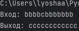
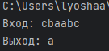

# lab2  

# Вариант 8  

## Задание
A={a,b,c} Если в слове P нет символа a, То заменить в P все b на c, а иначе выдать в качестве ответа слово состоящее из одного a  

## Проделанная работа

Написал программу используя пакет turing_machine. в программе ашина проходит по всей ленте, проверяя наличие символа a, и если он найден, то вся лента очищается и в начало записывается единственный символ a. Если символ a не найден, то производится замена всех символов b на c.

## Скриншоты

  

  

## Список использованных источников

[Документация truing_machine](https://github.com/dimazest/turing_machine/blob/master/Turing%20machine.ipynb)
